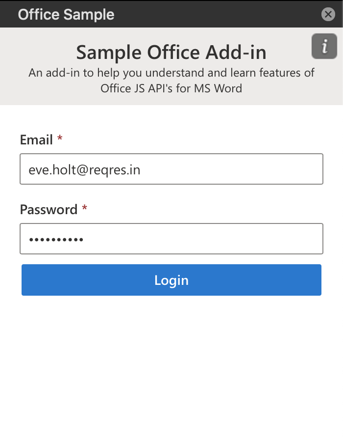
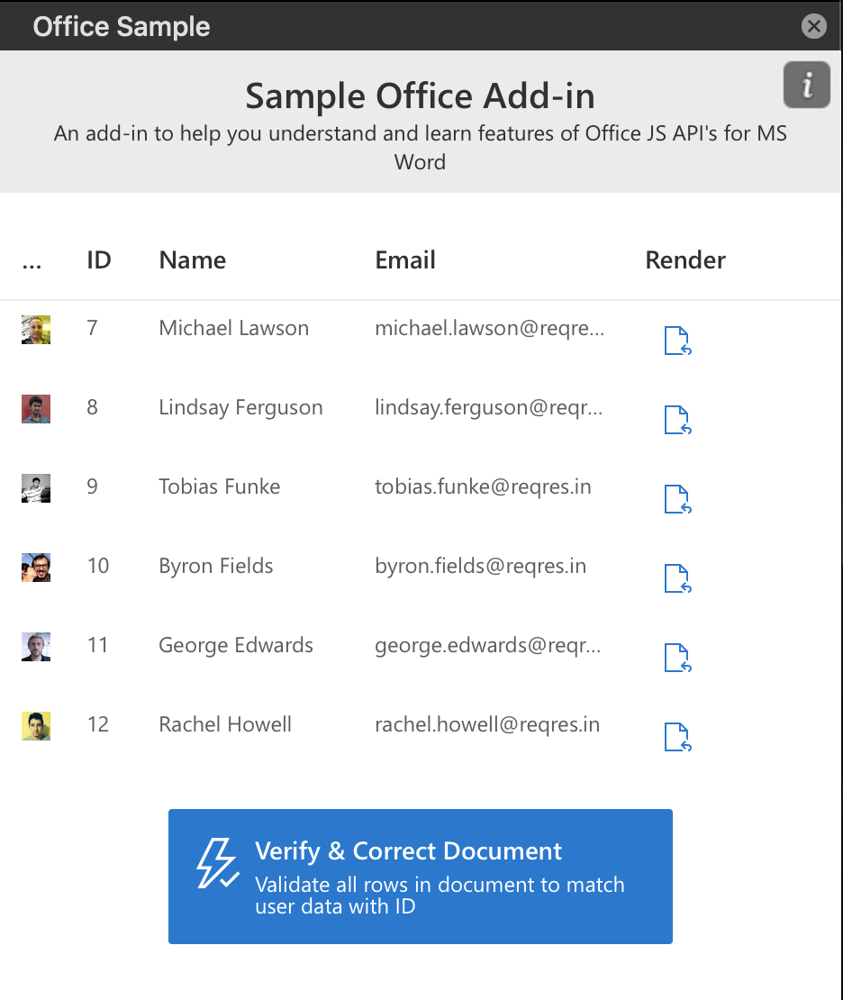

# Sample Office - Addin

This is a sample add-in with very little functionality but this is great starting point for getting started in Office Add-in development.

## Running this on Office Environment using remote url
- Manifest URL [manifest.xml](https://office-sample.netlify.app/manifest.xml)
- Sideload Office Add-ins - [Microsoft Help macOS](https://docs.microsoft.com/en-us/office/dev/add-ins/testing/sideload-an-office-add-in-on-ipad-and-mac)

## Screenshots

## Running this add-in using source code

- First install dependencies `npm install`
- On macOS run developement server `npm run dev-server`
- Run start command `npm start`

## Copyright

Copyright (c) 2020 Deepak Jangid. All rights reserved.
